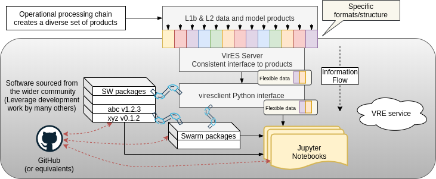

.. warning::

  `THESE PAGES HAVE MOVED TO swarm.magneticearth.org <https://swarm.magneticearth.org>`_

Collaborating
=============

This page provides guidance on how to work on the VRE and collaborate with others.

The primary way to interact with Swarm data on the VRE is through Jupyter notebooks that will be pre-loaded into the environment, but which can also be found as GitHub repositories. It is expected that users can take these notebooks as starting examples for their own analyses and that in time this approach will evolve into community-developed resources.

If you are working on a notebook on the VRE and want to share it with someone else, you can download it and email it to them - they can then upload it to their VRE account and run it straight away (but you must make sure your notebook is *self-contained* - that it does not rely on other special things in your environment such as data files). This is obviously cumbersome - What happens when you both make changes to your different versions and want to share them? What if you also include modules that the notebook depends on? What about sharing multiple notebooks? Why can't we work on the same file together simultaneously? We are looking for ways to improve this situation from within the VRE without needing to learn special tools, though this is not so trivial.

The best way to work collaboratively with other people is through a git repository hosted on GitHub `(learn git) <https://try.github.io/>`_. You may want to work towards building up a git repository that contains your analysis code, documentation, and reports - we are working on a :doc:`best-practices guide <notebook_development>` to support this.

Notebooks are great for immediate feedback, rapid iteration, and documenting and reproducing the steps in an analysis. As concepts in notebooks are developed, you will probably want to re-use the code in other notebooks to avoid repeating yourself. At this stage you should refactor the code into an importable module. Beyond this, to extend the utility of your code and share it with others, you may consider building a package that other people can rely on. An evolution of concepts through *notebooks -> modules -> packages* is thus created.

It is worth considering the *information architecture* which is being developed here:

Swarm data and models are accessed from the "VirES server" using the "viresclient" Python package. This package can be used directly within a notebook as a data access step as part of a given analysis and/or visualisation in conjunction with other Python packages also available on the VRE. Alternatively some notebooks may use a package (e.g. SwarmPyFAC) which uses viresclient in the background to provide a higher level interface to a given task while hiding the complexity of the data access.
