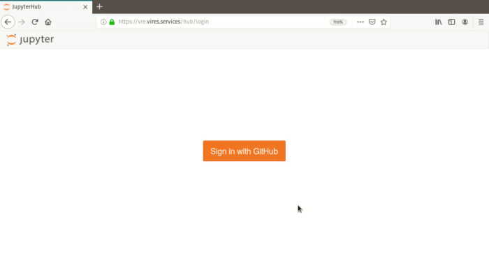

Introduction
============

----

.. raw:: html

   Notice:
   <iframe width="100%" height="500" src="https://hackmd.io/@swarm/vre-webinar-splash" frameborder="1"></iframe>

----

What is the VRE?
----------------

"VRE" refers to the "Virtual Research Environment" developed for ESA's *Swarm* mission. This is a cloud service to enable easy usage of *Swarm* data, based on the open source *Jupyter* technology.

- VirES (**Vir**\ tual Workspaces for **E**\ arth Observation **S**\ cientists) graphical interface (GUI): https://vires.services
- VRE (**V**\ irtual **R**\ esearch **E**\ nvironment) login: https://vre.vires.services
- viresclient Python package (i.e. integration with VirES, for Swarm data access): https://viresclient.readthedocs.io

JupyterLab runs in the cloud and enables you to login and run code directly through a web browser without any software needing to be installed on your machine. Data and software are all stored and executed in the cloud. We provide a curated Python environment (i.e. a collection of installed packages) to support scientific activities related to *Swarm*, with the aim of reliably and easily sharing code between users and stimulating the development of open source software related to Swarm.

.. image:: images/VRE-viresclient.png
   :alt: Architecture of VirES & VRE

Swarm data can be explored graphically through the web client (https://vires.services), or programmatically through JupyterLab (via the Python package, `viresclient <https://viresclient.readthedocs.io/>`_). Both approaches access the **VirES server** which provides more convenient data access than by working with the original data files directly. These systems will be further integrated in the future.

Getting access
--------------

The service is free to all, but you must first create a VirES account at https://vires.services. You can then access the VRE right away, either from the top pane of the VirES GUI (click on your username at the top right), or directly at https://vre.vires.services. To start using *viresclient* to access Swarm data, see :doc:`the introductory notebook <Swarm_notebooks/02a__Intro-Swarm-viresclient>`.

Related links
-------------

- Official ESA Swarm website: https://earth.esa.int/eogateway/missions/swarm
- Old ESA Swarm website: https://earth.esa.int/web/guest/missions/esa-operational-eo-missions/swarm
- EOX VirES blog posts: https://eox.at/category/vires/
