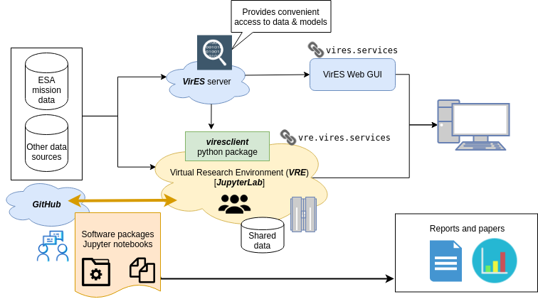

Introduction
============

What is the VRE?
----------------

"VRE" refers to the "Virtual Research Environment" developed for ESA's *Swarm* mission. This is a cloud service to provide an interactive computational environment to help exploit data from *Swarm*. The system is based on JupyterHub, and is integrated with the "VirES for Swarm" service.

- VirES (**Vir**\ tual environments for **E**\ arth **S**\ cientists): https://vires.services
- VRE (**V**\ irtual **R**\ esearch **E**\ nvironment): https://vre.vires.services

JupyterLab runs in the cloud and enables you to login and run code directly through a web browser without any software needing to be installed on your machine. Data and software are all stored and executed in the cloud. Jupyter itself is language-agnostic, meaning that it is possible to use multiple different programming languages, although it has its roots in Python. We provide a curated software environment (i.e. a collection of installed packages) to support scientific activities related to *Swarm*, with the aim of reliably and easily sharing code between users.

Swarm data can be explored graphically through the web client, or programmatically through JupyterLab (via the Python package, `"viresclient" <https://viresclient.readthedocs.io/>`_ ). Both approaches access the VirES server which provides more convenient data access than by working with the original data files directly. These systems will be further integrated in the future.

.. image:: images/VRE_shortest_demo.gif

Getting access
--------------

You must first create a VirES account at https://vires.services - it is recommended to use a GitHub account to login, and to use your GitHub username as your VirES username. This will help with identifying user accounts and sharing code both within and outwith the VRE via GitHub. Please then email info@vires.services, quoting your username, to have your account "upgraded" to VRE access. After this, you should be able to login to the VRE at https://vre.vires.services

Getting help
------------

For general enquiries and trouble logging in, please email: info@vires.services

If you find a particular bug or have a feature request, please use the GitHub issue tracker: `https://github.com/ESA-VirES/Swarm-VRE/issues <https://github.com/ESA-VirES/Swarm-VRE/issues>`_

We also have an unofficial public chat room (it will ask you to create an account): `https://riot.im/app/#/room/#vires:matrix.org <https://riot.im/app/#/room/#vires:matrix.org>`_

Related links
-------------

- Official ESA Swarm website: https://earth.esa.int/web/guest/missions/esa-operational-eo-missions/swarm
- EOX VirES blog posts: https://eox.at/category/vires/
